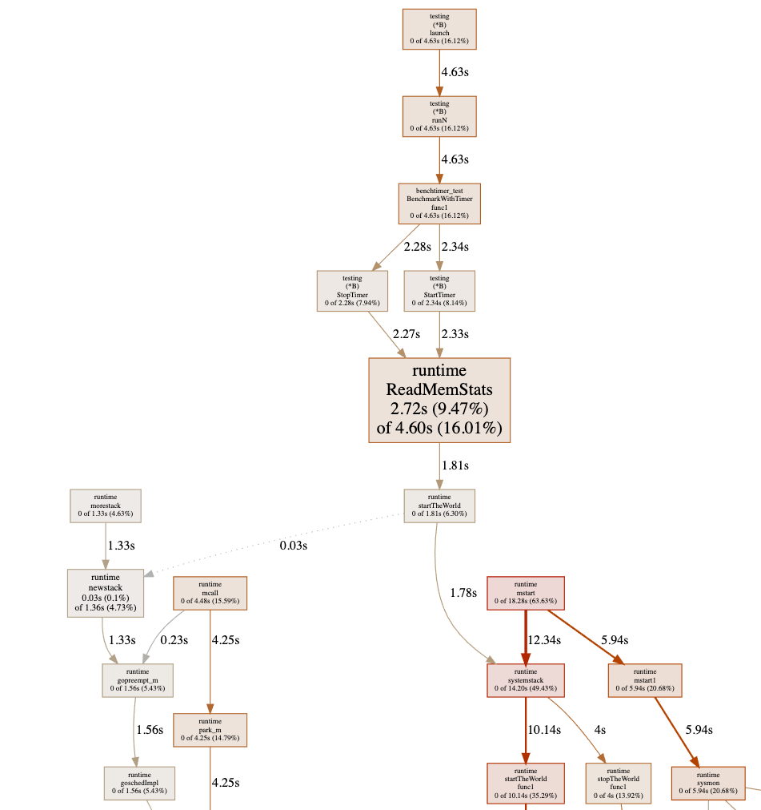
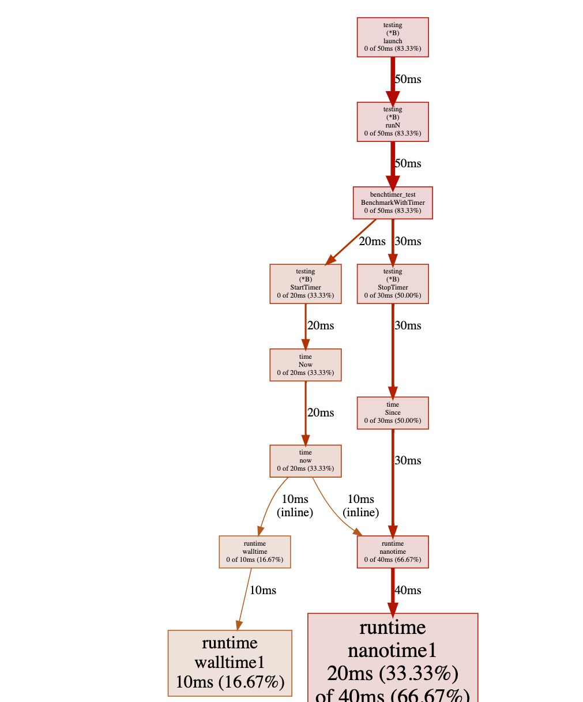

Author(s): [Changkun Ou](mailto:research[at]changkun.de)

Permalink: https://golang.design/research/bench-time

<!--abstract-->
About six months ago, I did a presentation[^ou2020bench]
that talks about how to conduct a reliable benchmark[^beyer2019reliable] in Go.
Recently, I submitted an issue #41641[^ou2020timer] to the Go project, which is also a subtle issue that you might need to address in some cases.
<!--more-->

## Introduction

It is all about the following code snippet:

```go
func BenchmarkAtomic(b *testing.B) {
	var v int32
	atomic.StoreInt32(&v, 0)
	b.Run("with-timer", func(b *testing.B) {
		for i := 0; i < b.N; i++ {
			b.StopTimer()
			// ... do extra stuff ...
			b.StartTimer()
			atomic.AddInt32(&v, 1)
		}
	})
	atomic.StoreInt32(&v, 0)
	b.Run("w/o-timer", func(b *testing.B) {
		for i := 0; i < b.N; i++ {
			atomic.AddInt32(&v, 1)
		}
	})
}
```

On my target machine (CPU Quad-core Intel Core i7-7700 (-MT-MCP-) speed/max 1341/4200 MHz Kernel 5.4.0-42-generic x86_64), running this snippet with the following command:

```
go test -run=none -bench=Atomic -benchtime=1000x -count=20 | \
	tee b.txt && benchstat b.txt
```

The result shows:

```
name                         time/op
Atomic/with-timer-8      32.6ns ± 7%
Atomic/w/o-timer-8       6.60ns ± 6%
```

Is it interesting to you? As you can see, the measurement without introducing `StopTimer/StartTimer` is 26ns faster than with the `StopTimer/StartTimer` pair.
So, how is this happening?

To dig more reason behind it, let's modify the snippet a little bit:

```go
func BenchmarkAtomic(b *testing.B) {
	var v int32
	var n = 1000000
	for k := 1; k < n; k *= 10 {
		b.Run(fmt.Sprintf("n-%d", k), func(b *testing.B) {
			atomic.StoreInt32(&v, 0)
			b.Run("with-timer", func(b *testing.B) {
				for i := 0; i < b.N; i++ {
					b.StopTimer()
					b.StartTimer()
					for j := 0; j < k; j++ {
						atomic.AddInt32(&v, 1)
					}
				}
			})
			atomic.StoreInt32(&v, 0)
			b.Run("w/o-timer", func(b *testing.B) {
				for i := 0; i < b.N; i++ {
					for j := 0; j < k; j++ {
						atomic.AddInt32(&v, 1)
					}
				}
			})
		})
	}
}
```

This time, we use the `k` to increase the number of atomic operations in the bench loop, i.e.:

```go
for j := 0; j < k; j++ {
	atomic.AddInt32(&v, 1)
}
```

Thus with higher `k`, the target code grows more costly. With similar command:

```
go test -run=none -bench=Atomic -benchtime=1000x -count=20 | \
	tee b.txt && benchstat b.txt
```

```
name                          time/op
Atomic/n-1/with-timer-8       34.8ns ±12%
Atomic/n-1/w/o-timer-8        6.44ns ± 1%
Atomic/n-10/with-timer-8      74.3ns ± 5%
Atomic/n-10/w/o-timer-8       47.6ns ± 3%
Atomic/n-100/with-timer-8      488ns ± 7%
Atomic/n-100/w/o-timer-8       456ns ± 2%
Atomic/n-1000/with-timer-8    4.65µs ± 3%
Atomic/n-1000/w/o-timer-8     4.63µs ±12%
Atomic/n-10000/with-timer-8   45.4µs ± 4%
Atomic/n-10000/w/o-timer-8    43.5µs ± 1%
Atomic/n-100000/with-timer-8   444µs ± 1%
Atomic/n-100000/w/o-timer-8    432µs ± 0%
```

What's interesting in the modified benchmark result is by testing target code with a higher cost,
the difference between `with-timer` and `w/o-timer` gets much closer. For instance, in the last pair of output when `n=100000`, the measured atomic operation only has `(444µs-432µs)/100000 = 0.12 ns` difference, which is pretty much accurate other than when `n=1` the error is `(34.8ns-6.44ns)/1 = 28.36 ns`.

How is this happening? There are two ways to trace the problem down to the bare bones.

<!--more-->

## Initial Investigation Using `go tool pprof`

As a standard procedure, let's benchmark the code that interrupts the timer and analysis the result using `go tool pprof`:

```go
func BenchmarkWithTimer(b *testing.B) {
	var v int32
	for i := 0; i < b.N; i++ {
		b.StopTimer()
		b.StartTimer()
		for j := 0; j < *k; j++ {
			atomic.AddInt32(&v, 1)
		}
	}
}
```

```
go test -v -run=none -bench=WithTimer -benchtime=100000x -count=5 \
	-cpuprofile cpu.pprof
```

Sadly, the graph shows a chunk of useless information where most of the costs shows as `runtime.ReadMemStats`:



This is because of the `StopTimer/StartTimer` implementation in the testing package calls `runtime.ReadMemStats`:

```go
package testing

(...)

func (b *B) StartTimer() {
	if !b.timerOn {
		runtime.ReadMemStats(&memStats) // <- here
		b.startAllocs = memStats.Mallocs
		b.startBytes = memStats.TotalAlloc
		b.start = time.Now()
		b.timerOn = true
	}
}

func (b *B) StopTimer() {
	if b.timerOn {
		b.duration += time.Since(b.start)
		runtime.ReadMemStats(&memStats) // <- here
		b.netAllocs += memStats.Mallocs - b.startAllocs
		b.netBytes += memStats.TotalAlloc - b.startBytes
		b.timerOn = false
	}
}
```

As we know that `runtime.ReadMemStats` stops the world, and each call to it is very time-consuming. This is an known issue #20875[^snyder2020memstats] regarding `runtime.ReadMemStats` in benchmarking.

Since we do not care about memory allocation at the moment, to avoid this issue, let's just hacking the source code by just comment out the call to `runtime.ReadMemStats`:

```go
package testing

(...)

func (b *B) StartTimer() {
	if !b.timerOn {
		// runtime.ReadMemStats(&memStats) // <- here
		b.startAllocs = memStats.Mallocs
		b.startBytes = memStats.TotalAlloc
		b.start = time.Now()
		b.timerOn = true
	}
}

func (b *B) StopTimer() {
	if b.timerOn {
		b.duration += time.Since(b.start)
		// runtime.ReadMemStats(&memStats) // <- here
		b.netAllocs += memStats.Mallocs - b.startAllocs
		b.netBytes += memStats.TotalAlloc - b.startBytes
		b.timerOn = false
	}
}
```

And re-run the test again, then we have:



Have you noticed where the problem is? Yes, there is a heavy cost in calling `time.Now()` in a tight loop (not really surprising because it is a system call).

## Further Verification Using C++

As you can see, the Go's pprof facility has its own problem while doing a benchmark,
one can only edit the source code of Go to verify the source of the measurement error.
Can we do something better than that?

Let's just write the initial benchmark in C++. This time, we go straightforward to the issue of `now()`:

```cpp
#include <iostream>
#include <chrono>

void empty() {}

int main() {
    int n = 1000000;
    for (int j = 0; j < 10; j++) {
        std::chrono::nanoseconds since(0);
        for (int i = 0; i < n; i++) {
            auto start = std::chrono::steady_clock::now();
            empty();
            since += std::chrono::steady_clock::now() - start;
        }
        std::cout << "avg since: " << since.count() / n << "ns \n";
    }
}
```

compile it with:

```
clang++ -std=c++17 -O3 -pedantic -Wall main.cpp
```

In this code snippet, we are trying to measure the performance of an empty function.
So, ideally, the output should be `0ns`. However, there is still a cost in calling
the empty function:

```
avg since: 17ns
avg since: 16ns
avg since: 16ns
avg since: 16ns
avg since: 16ns
avg since: 16ns
avg since: 16ns
avg since: 16ns
avg since: 16ns
avg since: 16ns
```

Furthermore, we could just simplify the code to the subtraction of two `now()` calls:

```cpp
#include <iostream>
#include <chrono>

int main() {
    int n = 1000000;
    for (int j = 0; j < 10; j++) {
        std::chrono::nanoseconds since(0);
        for (int i = 0; i < n; i++) {
            since -= std::chrono::steady_clock::now() -
                std::chrono::steady_clock::now();
        }
        std::cout << "avg since: " << since.count() / n << "ns \n";
    }
}
```

and you could see that the output remains end in the cost of `avg since: 16ns`.
**This proves that there is an overhead of calling `now()` for benchmarking.**
Thus, in terms of benchmarking, the actual measured time of a target code equals
to the execution time of target code plus the overhead of calling `now()`:


Assume the target code consumes in `T` ns, and the overhead of `now()` is `t` ns.
Now, let's run the target code `N` times.
The total measured time is `T*N+t`, then the average of a single iteration
of the target code is `T+t/N`. Thus, the systematic measurement error becomes: `t/N`.
Therefore with a higher `N`, you can get rid of the systematic error.

## The Solution

So, back to the original question, how can I get address the measurement error?
A quick and dirty solution is just subtract the overhead of calling `now()`:

```cpp
#include <iostream>
#include <chrono>

void target() {}

int main() {
    int n = 1000000;
    for (int j = 0; j < 10; j++) {
        std::chrono::nanoseconds since(0);
        for (int i = 0; i < n; i++) {
            auto start = std::chrono::steady_clock::now();
            target();
            since += std::chrono::steady_clock::now() - start;
        }

        auto overhead = -(std::chrono::steady_clock::now() -
                          std::chrono::steady_clock::now());
        since -= overhead * n;

        std::cout << "avg since: " << since.count() / n << "ns \n";
    }
}
```

And in Go, you could do:

```go
var v int32
atomic.StoreInt32(&v, 0)
r := testing.Benchmark(func(b *testing.B) {
  for i := 0; i < b.N; i++ {
    b.StopTimer()
    // ... do extra stuff ...
    b.StartTimer()
    atomic.AddInt32(&v, 1)
  }
})

// do calibration that removes the overhead of calling time.Now().
calibrate := func(d time.Duration, n int) time.Duration {
  since := time.Duration(0)
  for i := 0; i < n; i++ {
    start := time.Now()
    since += time.Since(start)
  }
  return (d - since) / time.Duration(n)
}

fmt.Printf("%v ns/op\n", calibrate(r.T, r.N))
```

As a take-away message, if you would like to write a micro-benchmark (whose runs in nanoseconds), and you have to interrupt the timer to clean up and reset some resources for some reason, then you must do a calibration on the measurement. If the Go's benchmark facility plans to fix #41641[^ou2020timer], then it is great; but if they don't, at least you are aware of this issue and know how to fix it now.

## References

[^ou2020bench]: Changkun Ou. 2020. Conduct Reliable Benchmarking in Go. TalkGo Meetup. Virtual Event. March 26. https://golang.design/s/gobench
[^ou2020timer]: Changkun Ou. 2020. testing: inconsistent benchmark measurements when interrupts timer. The Go Project Issue Tracker. Sep 26. https://go.dev/issue/41641
[^snyder2020memstats]: Josh Bleecher Snyder. 2020. testing: consider calling ReadMemStats less during benchmarking. The Go Project Issue Tracker. Jul 1. https://go.dev/issue/20875
[^beyer2019reliable]: Beyer, D., Löwe, S. \& Wendler, P. 2019. Reliable benchmarking: requirements and solutions. International Journal on Software Tools for Technology Transfer. Issue 21. https://doi.org/10.1007/s10009-017-0469-y
