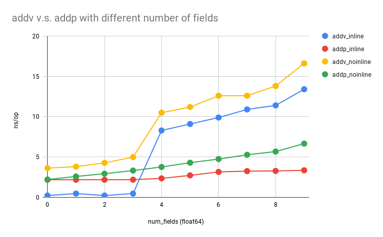

Author(s): [Changkun Ou](mailto:research[at]changkun.de)

Permalink: https://golang.design/research/pointer-params

<!--abstract-->
We are aware that using pointers for passing parameters can avoid data copy,
which will benefit the performance. Nevertheless, there are always some
edge cases we might need concern.
<!--more-->

## Introduction

Let's take this as an example:

```go
// vec.go
type vec struct {
	x, y, z, w float64
}

func (v vec) addv(u vec) vec {
	return vec{v.x + u.x, v.y + u.y, v.z + u.z, v.w + u.w}
}

func (v *vec) addp(u *vec) *vec {
	v.x, v.y, v.z, v.w = v.x+u.x, v.y+u.y, v.z+u.z, v.w+u.w
	return v
}
```

Which vector addition runs faster?
Intuitively, we might consider that `vec.addp` is faster than `vec.addv`
because its parameter `u` uses pointer form. There should be no copies
of the data, whereas `vec.addv` involves data copy both when passing and
returning.

However, if we do a micro-benchmark:

```go
func BenchmarkVec(b *testing.B) {
	b.Run("addv", func(b *testing.B) {
		v1 := vec{1, 2, 3, 4}
		v2 := vec{4, 5, 6, 7}
		b.ReportAllocs()
		b.ResetTimer()
		for i := 0; i < b.N; i++ {
			if i%2 == 0 {
				v1 = v1.addv(v2)
			} else {
				v2 = v2.addv(v1)
			}
		}
	})
	b.Run("addp", func(b *testing.B) {
		v1 := &vec{1, 2, 3, 4}
		v2 := &vec{4, 5, 6, 7}
		b.ReportAllocs()
		b.ResetTimer()
		for i := 0; i < b.N; i++ {
			if i%2 == 0 {
				v1 = v1.addp(v2)
			} else {
				v2 = v2.addp(v1)
			}
		}
	})
}
```

And run as follows:

```sh
$ perflock -governor 80% go test -v -run=none -bench=. -count=10 | tee new.txt
$ benchstat new.txt
```

The `benchstat` will give you the following result:

```
name         time/op
Vec/addv-16  0.25ns ± 2%
Vec/addp-16  2.20ns ± 0%

name         alloc/op
Vec/addv-16   0.00B
Vec/addp-16   0.00B

name         allocs/op
Vec/addv-16    0.00
Vec/addp-16    0.00
```

How is this happening?

## Inlining Optimization

This is all because of compiler optimization, and mostly because of inlining.

If we disable inline[^cheney2020inline] [^cheney2020inline2] from the `addv` and `addp`:

```go
//go:noinline
func (v vec) addv(u vec) vec {
	return vec{v.x + u.x, v.y + u.y, v.z + u.z, v.w + u.w}
}

//go:noinline
func (v *vec) addp(u *vec) *vec {
	v.x, v.y, v.z, v.w = v.x+u.x, v.y+u.y, v.z+u.z, v.w+u.w
	return v
}
```

Then run the benchmark and compare the perf with the previous one:

```sh
$ perflock -governor 80% go test -v -run=none -bench=. -count=10 | tee old.txt
$ benchstat old.txt new.txt
name         old time/op    new time/op    delta
Vec/addv-16    4.99ns ± 1%    0.25ns ± 2%  -95.05%  (p=0.000 n=9+10)
Vec/addp-16    3.35ns ± 1%    2.20ns ± 0%  -34.37%  (p=0.000 n=10+8)
```

The inline optimization transforms the `vec.addv`:

```go
v1 := vec{1, 2, 3, 4}
v2 := vec{4, 5, 6, 7}
v1 = v1.addv(v2)
```

to a direct assign statement:

```go
v1 := vec{1, 2, 3, 4}
v2 := vec{4, 5, 6, 7}
v1 = vec{1+4, 2+5, 3+6, 4+7}
```

And for the `vec.addp`'s case:

```go
v1 := &vec{1, 2, 3, 4}
v2 := &vec{4, 5, 6, 7}
v1 = v1.addp(v2)
```

to a direct manipulation:

```go
v1 := vec{1, 2, 3, 4}
v2 := vec{4, 5, 6, 7}
v1.x, v1.y, v1.z, v1.w = v1.x+v2.x, v1.y+v2.y, v1.z+v2.z, v1.w+v2.w
```

## Addressing Modes

If we check the compiled assembly, the reason reveals quickly:

```sh
$ mkdir asm && go tool compile -S vec.go > asm/vec.s
```

The dumped assumbly code is as follows:

```
"".vec.addv STEXT nosplit size=89 args=0x60 locals=0x0 funcid=0x0
	0x0000 00000 (vec.go:7)	TEXT	"".vec.addv(SB), NOSPLIT|ABIInternal, $0-96
	0x0000 00000 (vec.go:7)	FUNCDATA	$0, gclocals·33cdeccccebe80329f1fdbee7f5874cb(SB)
	0x0000 00000 (vec.go:7)	FUNCDATA	$1, gclocals·33cdeccccebe80329f1fdbee7f5874cb(SB)
	0x0000 00000 (vec.go:8)	MOVSD	"".u+40(SP), X0
	0x0006 00006 (vec.go:8)	MOVSD	"".v+8(SP), X1
	0x000c 00012 (vec.go:8)	ADDSD	X1, X0
	0x0010 00016 (vec.go:8)	MOVSD	X0, "".~r1+72(SP)
	0x0016 00022 (vec.go:8)	MOVSD	"".u+48(SP), X0
	0x001c 00028 (vec.go:8)	MOVSD	"".v+16(SP), X1
	0x0022 00034 (vec.go:8)	ADDSD	X1, X0
	0x0026 00038 (vec.go:8)	MOVSD	X0, "".~r1+80(SP)
	0x002c 00044 (vec.go:8)	MOVSD	"".u+56(SP), X0
	0x0032 00050 (vec.go:8)	MOVSD	"".v+24(SP), X1
	0x0038 00056 (vec.go:8)	ADDSD	X1, X0
	0x003c 00060 (vec.go:8)	MOVSD	X0, "".~r1+88(SP)
	0x0042 00066 (vec.go:8)	MOVSD	"".u+64(SP), X0
	0x0048 00072 (vec.go:8)	MOVSD	"".v+32(SP), X1
	0x004e 00078 (vec.go:8)	ADDSD	X1, X0
	0x0052 00082 (vec.go:8)	MOVSD	X0, "".~r1+96(SP)
	0x0058 00088 (vec.go:8)	RET
"".(*vec).addp STEXT nosplit size=73 args=0x18 locals=0x0 funcid=0x0
	0x0000 00000 (vec.go:11)	TEXT	"".(*vec).addp(SB), NOSPLIT|ABIInternal, $0-24
	0x0000 00000 (vec.go:11)	FUNCDATA	$0, gclocals·522734ad228da40e2256ba19cf2bc72c(SB)
	0x0000 00000 (vec.go:11)	FUNCDATA	$1, gclocals·69c1753bd5f81501d95132d08af04464(SB)
	0x0000 00000 (vec.go:12)	MOVQ	"".u+16(SP), AX
	0x0005 00005 (vec.go:12)	MOVSD	(AX), X0
	0x0009 00009 (vec.go:12)	MOVQ	"".v+8(SP), CX
	0x000e 00014 (vec.go:12)	ADDSD	(CX), X0
	0x0012 00018 (vec.go:12)	MOVSD	8(AX), X1
	0x0017 00023 (vec.go:12)	ADDSD	8(CX), X1
	0x001c 00028 (vec.go:12)	MOVSD	16(CX), X2
	0x0021 00033 (vec.go:12)	ADDSD	16(AX), X2
	0x0026 00038 (vec.go:12)	MOVSD	24(AX), X3
	0x002b 00043 (vec.go:12)	ADDSD	24(CX), X3
	0x0030 00048 (vec.go:12)	MOVSD	X0, (CX)
	0x0034 00052 (vec.go:12)	MOVSD	X1, 8(CX)
	0x0039 00057 (vec.go:12)	MOVSD	X2, 16(CX)
	0x003e 00062 (vec.go:12)	MOVSD	X3, 24(CX)
	0x0043 00067 (vec.go:13)	MOVQ	CX, "".~r1+24(SP)
	0x0048 00072 (vec.go:13)	RET
```

The `addv` implementation uses values from the previous stack frame and
writes the result directly to the return; whereas `addp` needs MOVQ[^man2020movsd] [^man2020addsd] [^man2020moveq] that
copies the parameter to different registers (e.g., copy pointers to AX and CX),
then write back when returning. Therefore, with inline disabled, the reason that `addv` is slower than `addp` is caused by different memory access pattern.

## Conclusion

Can pass by value always faster than pass by pointer? We could do a further test.
But this time, we need use a generator to generate all possible cases. Here
is how we could do it:

```go
// gen.go

// +build ignore

package main

import (
	"bytes"
	"fmt"
	"go/format"
	"io/ioutil"
	"strings"
	"text/template"
)

var (
	head = `// Code generated by go run gen.go; DO NOT EDIT.
package fields_test

import "testing"
`
	structTmpl = template.Must(template.New("ss").Parse(`
type {{.Name}} struct {
	{{.Properties}}
}

func (s {{.Name}}) addv(ss {{.Name}}) {{.Name}} {
	return {{.Name}}{
		{{.Addv}}
	}
}

func (s *{{.Name}}) addp(ss *{{.Name}}) *{{.Name}} {
	{{.Addp}}
	return s
}
`))
	benchHead = `func BenchmarkVec(b *testing.B) {`
	benchTail = `}`
	benchBody = template.Must(template.New("bench").Parse(`
	b.Run("addv-{{.Name}}", func(b *testing.B) {
		{{.InitV}}
		b.ResetTimer()
		for i := 0; i < b.N; i++ {
			if i%2 == 0 {
				v1 = v1.addv(v2)
			} else {
				v2 = v2.addv(v1)
			}
		}
	})
	b.Run("addp-{{.Name}}", func(b *testing.B) {
		{{.InitP}}
		b.ResetTimer()
		for i := 0; i < b.N; i++ {
			if i%2 == 0 {
				v1 = v1.addp(v2)
			} else {
				v2 = v2.addp(v1)
			}
		}
	})
`))
)

type structFields struct {
	Name       string
	Properties string
	Addv       string
	Addp       string
}
type benchFields struct {
	Name  string
	InitV string
	InitP string
}

func main() {
	w := new(bytes.Buffer)
	w.WriteString(head)

	N := 10

	for i := 0; i < N; i++ {
		var (
			ps   = []string{}
			adv  = []string{}
			adpl = []string{}
			adpr = []string{}
		)
		for j := 0; j <= i; j++ {
			ps = append(ps, fmt.Sprintf("x%d\tfloat64", j))
			adv = append(adv, fmt.Sprintf("s.x%d + ss.x%d,", j, j))
			adpl = append(adpl, fmt.Sprintf("s.x%d", j))
			adpr = append(adpr, fmt.Sprintf("s.x%d + ss.x%d", j, j))
		}
		err := structTmpl.Execute(w, structFields{
			Name:       fmt.Sprintf("s%d", i),
			Properties: strings.Join(ps, "\n"),
			Addv:       strings.Join(adv, "\n"),
			Addp:       strings.Join(adpl, ",") + " = " + strings.Join(adpr, ","),
		})
		if err != nil {
			panic(err)
		}
	}

	w.WriteString(benchHead)
	for i := 0; i < N; i++ {
		nums1, nums2 := []string{}, []string{}
		for j := 0; j <= i; j++ {
			nums1 = append(nums1, fmt.Sprintf("%d", j))
			nums2 = append(nums2, fmt.Sprintf("%d", j+i))
		}
		numstr1 := strings.Join(nums1, ", ")
		numstr2 := strings.Join(nums2, ", ")

		err := benchBody.Execute(w, benchFields{
			Name: fmt.Sprintf("s%d", i),
			InitV: fmt.Sprintf(`v1 := s%d{%s}
v2 := s%d{%s}`, i, numstr1, i, numstr2),
			InitP: fmt.Sprintf(`v1 := &s%d{%s}
			v2 := &s%d{%s}`, i, numstr1, i, numstr2),
		})
		if err != nil {
			panic(err)
		}
	}
	w.WriteString(benchTail)

	out, err := format.Source(w.Bytes())
	if err != nil {
		panic(err)
	}
	if err := ioutil.WriteFile("impl_test.go", out, 0660); err != nil {
		panic(err)
	}
}
```

If we generate our test code and perform the same benchmark procedure again:

```bash
$ go generate
$ perflock -governor 80% go test -v -run=none -bench=. -count=10 | tee inline.txt
$ benchstat inline.txt
name            time/op
Vec/addv-s0-16  0.25ns ± 0%
Vec/addp-s0-16  2.20ns ± 0%
Vec/addv-s1-16  0.49ns ± 1%
Vec/addp-s1-16  2.20ns ± 0%
Vec/addv-s2-16  0.25ns ± 1%
Vec/addp-s2-16  2.20ns ± 0%
Vec/addv-s3-16  0.49ns ± 2%
Vec/addp-s3-16  2.21ns ± 1%
Vec/addv-s4-16  8.29ns ± 0%
Vec/addp-s4-16  2.37ns ± 1%
Vec/addv-s5-16  9.06ns ± 1%
Vec/addp-s5-16  2.74ns ± 1%
Vec/addv-s6-16   9.9ns ± 0%
Vec/addp-s6-16  3.17ns ± 0%
Vec/addv-s7-16  10.9ns ± 1%
Vec/addp-s7-16  3.27ns ± 1%
Vec/addv-s8-16  11.4ns ± 0%
Vec/addp-s8-16  3.29ns ± 0%
Vec/addv-s9-16  13.4ns ± 1%
Vec/addp-s9-16  3.37ns ± 0%
```

We could even further try a version that disables inline:

```diff
structTmpl = template.Must(template.New("ss").Parse(`
type {{.Name}} struct {
	{{.Properties}}
}
+//go:noinline
func (s {{.Name}}) addv(ss {{.Name}}) {{.Name}} {
	return {{.Name}}{
		{{.Addv}}
	}
}
+//go:noinline
func (s *{{.Name}}) addp(ss *{{.Name}}) *{{.Name}} {
	{{.Addp}}
	return s
}
`))
```

Eventually, we will endup with the following results:



TLDR: The above figure basically demonstrates when should you pass-by-value
or pass-by-pointer. If you are certain that your code won't produce any escape
variables, and the size of your argument is smaller than 4*8 = 32 bytes,
then you should go for pass-by-value; otherwise, you should keep using pointers.

## References

[^cheney2020inline]: Dave Cheney. Mid-stack inlining in Go. May 2, 2020. https://dave.cheney.net/2020/05/02/mid-stack-inlining-in-go
[^cheney2020inline2]: Dave Cheney. Inlining optimisations in Go. April 25, 2020. https://dave.cheney.net/2020/04/25/inlining-optimisations-in-go
[^man2020movsd]: MOVSD. Move or Merge Scalar Double-Precision Floating-Point Value. Last access: 2020-10-27. https://www.felixcloutier.com/x86/movsd
[^man2020addsd]: ADDSD. Add Scalar Double-Precision Floating-Point Values. Last access: 2020-10-27. https://www.felixcloutier.com/x86/addsd
[^man2020moveq]: MOVEQ. Move Quadword. Last access: 2020-10-27. https://www.felixcloutier.com/x86/movq
