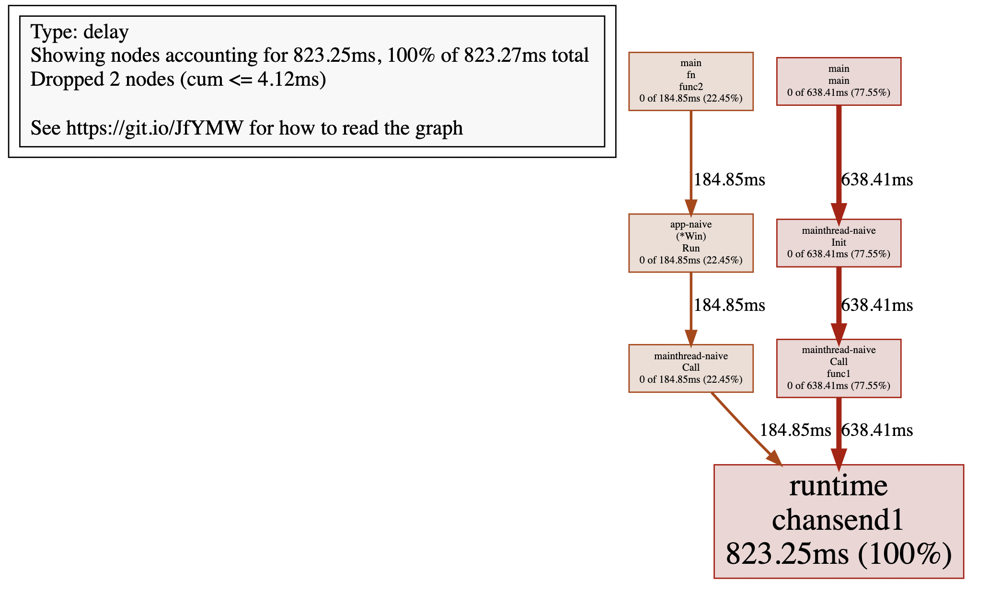
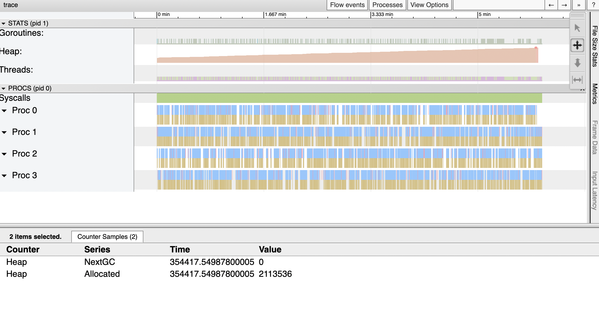

Author(s): [Changkun Ou](https://changkun.de)

GUI programming in Go is a little bit tricky. The infamous issue
regarding interacting with the legacy GUI frameworks is that most of
the graphics related APIs must be called from the main thread.
This basically violates the concurrent nature of Go: A goroutine may be
arbitrarily and randomly scheduled or rescheduled on different running
threads, i.e., the same pice of code will be called from different
threads over time, even without evolving the `go` keyword.

<!--more-->

## Background

In multi-threaded programming, operating systems provide space,
the so-called Thread Local Storage (TLS) for each thread of a process
to store their private and local content. In the era where multithreaded
programming and scheduling algorithms are not rich enough,
the TLS feature was very useful to avoid data race since this storage is
purely local and guaranteed by the operating system.

For example, a graphics rendering backend such as OpenGL Context was
designed to store the rendering context of each thread on TLS;
In macOS, the famous GUI framework Cocoa also requires rendering user
interfaces on a specific thread, that is the so-called *main thread*.

## The Main Thread

In Go, as we all know that a goroutine will be scheduled on different
threads due to its internal work-stealing scheduler [^work-steal] [^go11sched].

With work-tealing scheduler, goroutines are not promised to run on a specific
thread forever. Instead, whenever a goroutine goes to sleep, or endering a
system call, or the Go's runtime proactively interrupts the execution of
that goroutine, it is likely to be rescheduled to a different thread.
Therefore, if a rendering (OpenGL) context is stored on the old thread,
after switching to a new thread will cause the lose of that old context, too.
**Because such an interruption can happen at anytime and anywhere,
it is impossible to check if the goroutine remains on the same thread
when the execution resumes.**

The original intntion of designing such a scheduler is to eliminate
the concept of system thread and multiplexing it. In this way, users won't
suffer from the paying the cost of threads switch/sleep whereas threads
always in its full power mode that constantly running tasks either from
user or the runtime.

### Method `runtime.LockOSThread` and Package `mainthread`

If GUI applications must interact with the OS on the main thread,
how can we achieve the goal where we want run a specific thread perminantly?
Luckily, there is a method called `LockOSThread` offered from the
`runtime` package, provides the exact feature we want:

```go
// LockOSThread wires the calling goroutine to its current operating system thread.
// The calling goroutine will always execute in that thread,
// and no other goroutine will execute in it,
// until the calling goroutine has made as many calls to
// UnlockOSThread as to LockOSThread.
// If the calling goroutine exits without unlocking the thread,
// the thread will be terminated.
//
// All init functions are run on the startup thread. Calling LockOSThread
// from an init function will cause the main function to be invoked on
// that thread.
//
// A goroutine should call LockOSThread before calling OS services or
// non-Go library functions that depend on per-thread state.
func LockOSThread()
```

As the document of `LockOSThread` says: All `init` functions are run on
the startup thread. Calling `LockOSThread` from an `init` function will
cause the main function to be invoked on that thread.

If you think about that carefully, you will immediately realize this gives
us the opportunity to identify, at least, the main thread.
When we would like to wrapping thread scheduling as a package `mainthread`,
we can do something like the following:

```go
package mainthread // import "x/mainthread"

import "runtime"

func init() {
	runtime.LockOSThread()
}

// Init initializes the functionality of running arbitrary subsequent
// functions be called on the main system thread.
//
// Init must be called in the main.main function.
func Init(main func())

// Call calls f on the main thread and blocks until f finishes.
func Call(f func())
```

As a user of such a package, one can:

```go
package main

func main() {
	mainthread.Init(fn)
}

func fn() {
	// ... do what ever we want to do in main ...
}


func gn() {
	// Wherever gn is running, the call will be executed on the main thread.
	mainthread.Call(func() {
		// ... do whatever we want to run on the main thread ...
	})
}
```

Once we solved the problem of API design, the next question is:
How can we implement the `Init` and `Call`?

Well, it is not that difficult. Recall that we use `Init` method
to obtain the full control of the main thread, then we should never and
ever to give up such a power. Thus, creating another goroutine to run
what we initially wants to run, and use a channel to receive
the calls that we would like to schedule on the main thread
becomes our only option:

```go
// funcQ is a global channel that responsible for receiving function
// calls that needs to run on the main thread.
var funcQ = make(chan func(), runtime.GOMAXPROCS(0))

func Init(main func()) {
	done := make(chan struct{})
	go func() {
		main()

		// main function terminates, signal and terminate
		// the main thread too.
		done <- struct{}{}
	}()

	for {
		select {
		case f := <-funcQ:
				f()
		case <-done:
			return
		}
	}
}
```

Since we have the global `funcQ`, scheduling a function via that channel
becomes an easy work:

```go
// Call calls f on the main thread and blocks until f finishes.
func Call(f func()) {
	done := make(chan struct{})
	funcQ <- func() {
		f()
		done <- struct{}{}
	}
	<-done
}
```

To use such a package, one can use `mainthread.Call` to schedule
a call to be executed on the main thread:

```go
package main

import "x/mainthread"

func main() {
	mainthread.Init(fn)
}

func fn() {
	done := make(chan struct{})
	go gn(done)
	<-done
}

func gn(done chan<- struct{}) {
	mainthread.Call(func() {
		println("call on the main thread.")
	})
	done <- struct{}{}
}
```

### Creating A Window with `glfw` using `mainthread`

Whenever we need to wrap a window package, such as initializing `glfw` [^glfw]:

```go
package app // import "x/app"

import (
	"x/mainthread"

	"github.com/go-gl/glfw/v3.3/glfw"
)

// Init initializes an app environment.
func Init() (err error) {
	mainthread.Call(func() { err = glfw.Init() })
	return
}

// Terminate terminates the entire application.
func Terminate() {
	mainthread.Call(glfw.Terminate)
}
```

and make sure critical calls like `glfw.WaitEventsTimeout` inside
the rendering loop always be executed from the main thread:

```go
package app // import "x/app"

// Win is a window.
type Win struct {
	win *glfw.Window
}

// NewWindow constructs a new graphical window.
func NewWindow() (*Win, error) {
	var (
		w   = &Win{}
		err error
	)
	mainthread.Call(func() {
		w.win, err = glfw.CreateWindow(640, 480, "golang.design/research", nil, nil)
		if err != nil {
			return
		}
	})
	if err != nil {
		return nil, err
	}
	w.win.MakeContextCurrent()
	return w, nil
}

// Run runs the given window and blocks until it is destroied.
func (w *Win) Run() {
	for !w.win.ShouldClose() {
		mainthread.Call(func() {
			w.win.SwapBuffers()

			// This function must be called from the main thread.
			glfw.WaitEventsTimeout(1.0 / 30)
		})
	}
	// This function must be called from the mainthread.
	mainthread.Call(w.win.Destroy)
}
```

As a user of `app` package, can get rid of the understanding
and thought overhead about when and how do we call a function
on the main thread:

```go
package main

import (
	"x/app"
	"x/mainthread"
)

func main() {
	mainthread.Init(fn)
}

func fn() {
	err := app.Init()
	if err != nil {
		panic(err)
	}
	defer app.Terminate()
	w, err := app.NewWindow()
	if err != nil {
		panic(err)
	}
	w.Run()
}
```


Now, we have an empty solid window and will never be crashed randomly 😄.

## Cost Analysis and Optimization

After implementing a first iteration of the `mainthread` package,
we might directly wonder about the performance of this package,
questions could be:

_If a function is sent from a thread to the main thread, what's the
latency when calling such a function?_

Let's write a few benchmark tests that can measure the performance of
such a call. The idea is very simple, we need a baseline to identify
the initial cost of calling a function, then measure the completion
time when we schedule the same function call on the main thread:

```go
var f = func() {}

// Baseline: call f() directly.
func BenchmarkDirectCall(b *testing.B) {
	b.ReportAllocs()
	b.ResetTimer()
	for i := 0; i < b.N; i++ {
		f()
	}
}

// MainthreadCall: call f() on the mainthread.
func BenchmarkMainThreadCall(b *testing.B) {
	mainthread.Init(func() {
		b.ReportAllocs()
		b.ResetTimer()
		for i := 0; i < b.N; i++ {
			mainthread.Call(f)
		}
	})
}
```

Be careful with micro benchmarks here, as we discussed in our previous
research [^bench-time], let's use the `golang.design/s/bench`
tool [^bench-tool] for benchmarking:

```
$ bench
goos: darwin
goarch: arm64
pkg: x/mainthread-naive
...

name              time/op
DirectCall-8      0.95ns ±1%
MainThreadCall-8   448ns ±0%

name              alloc/op
DirectCall-8       0.00B
MainThreadCall-8    120B ±0%

name              allocs/op
DirectCall-8        0.00
MainThreadCall-8    2.00 ±0%
```

The benchmark result indicates that calling an empty function directly in Go
will `1ns` whereas schedule the same empty function to the main thread
will spend `448ns`. Thus the cost is `447ns`. If we visualizes out the trace information, we can quickly see that sending function to a channel contributes a notably cost:



Moreover, when we talk about cost,
we actually care about the cost of CPU as well as memory consumption.
According to the second report regarding `allocs/op`, the result shows
scheduling an empty function to the mainthread will cost `120B` allocation.

Allocation of `120B` per operation might not be a big deal from our first impression.
However, if we consider the actual use case of this package, i.e. managing GUI rendering 
calls, either CPU or memory allocation can be propagated to a huge cost over time.
If we are dealing with rendering, especially graphical rendering, the fresh rate
is typically minimum 25fps, ideally 30fps or even higher.

This means, every 5 minutes, without considering mouse button, movements,
and keystrokes, a GUI application will allocate at least:

$$
5 \times 60\times 30 \times 120 \text{byte} = 1.08 \text{MiB}
$$

A directly impact from an excessive allocation behavior is the runtime garbage
collector and the scavenger. With higher allocation rate, the garbage collector
is triggered more often, and the scavenger releases memory to the OS more often.
Because of more works are produced for the GC, the GC will also consume more
CPU from the system. It is good enough to say the entire application is
a vicious circle.

The following is a trace information of that above application runs in 6 minutes, the total heap allocation is actually 1.41 MiB (2113536-630784 byte), preety close to what we predicted before.



How can we deal with these issues? How to optimize the exisiting naive
implementation?


## Optimal Threading Control

The first optimization 

```
$ bench
goos: darwin
goarch: arm64
pkg: x/mainthread-opt1

name              time/op
DirectCall-8      0.95ns ±1%
MainThreadCall-8   440ns ±0%

name              alloc/op
DirectCall-8                        0.00B     
MainThreadCall-8   24.0B ±0%

name              allocs/op
DirectCall-8                         0.00     
MainThreadCall-8    1.00 ±0%
```

```
name              old time/op    new time/op      delta
DirectCall-8      0.95ns ±1%         0.95ns ±1%    ~     (p=0.631 n=10+10)
MainThreadCall-8   448ns ±0%         440ns ±0%   -1.83%  (p=0.000 n=9+9)

name              old alloc/op   new alloc/op     delta
DirectCall-8       0.00B            0.00B          ~     (all equal)
MainThreadCall-8    120B ±0%          24B ±0%   -80.00%  (p=0.000 n=10+10)

name              old allocs/op  new allocs/op    delta
DirectCall-8        0.00             0.00          ~     (all equal)
MainThreadCall-8    2.00 ±0%         1.00 ±0%   -50.00%  (p=0.000 n=10+10)
```

The second optimization:

```
$ bench
goos: darwin
goarch: arm64
pkg: x/mainthread-opt2

name              time/op
DirectCall-8      0.95ns ±1%
MainThreadCall-8   366ns ±1%

name              alloc/op
DirectCall-8       0.00B     
MainThreadCall-8   0.00B     

name              allocs/op
DirectCall-8        0.00     
MainThreadCall-8    0.00
```

```
name              old time/op    new time/op    delta
DirectCall-8      0.95ns ±1%      0.95ns ±1%     ~     (p=0.617 n=10+10)
MainThreadCall-8   440ns ±0%       366ns ±1%   -16.64%  (p=0.000 n=9+9)

name              old alloc/op   new alloc/op    delta
DirectCall-8       0.00B            0.00B          ~     (all equal)
MainThreadCall-8   24.0B ±0%        0.0B       -100.00%  (p=0.000 n=10+10)

name              old allocs/op  new allocs/op   delta
DirectCall-8        0.00             0.00          ~     (all equal)
MainThreadCall-8    1.00 ±0%         0.00       -100.00%  (p=0.000 n=10+10)
```

Comparing to the naive implementation:

```
name              old time/op     new time/op     delta
DirectCall-8      0.95ns ±1%      0.95ns ±1%        ~      (p=0.896 n=10+10)
MainThreadCall-8   448ns ±0%       366ns ±1%     -18.17%   (p=0.000 n=9+9)

name              old alloc/op    new alloc/op    delta
DirectCall-8       0.00B             0.00B          ~      (all equal)
MainThreadCall-8    120B ±0%            0B       -100.00%  (p=0.000 n=10+10)

name              old allocs/op   new allocs/op   delta
DirectCall-8        0.00             0.00           ~      (all equal)
MainThreadCall-8    2.00 ±0%         0.00       -100.00%   (p=0.000 n=10+10)
```

## Verification and Discussion

TODO:

```
bench: run benchmarks under 90% cpufreq...
bench: go test -run=^$ -bench=. -count=10
goos: linux
goarch: amd64
pkg: x/mainthread
cpu: Intel(R) Core(TM) i9-9900K CPU @ 3.60GHz

name     time/op
Call-8   373ns ± 0%
CallV-8  375ns ± 0%

name     alloc/op
Call-8   0.00B
CallV-8  0.00B

name     allocs/op
Call-8    0.00
CallV-8   0.00
```

Before v.s. After:

```
name     old time/op    new time/op    delta
Call-8      398ns ± 0%     373ns ± 0%    -6.31%  (p=0.000 n=10+9)
CallV-8     375ns ± 0%     375ns ± 0%      ~     (p=0.323 n=10+10)

name     old alloc/op   new alloc/op   delta
Call-8      96.0B ± 0%      0.0B       -100.00%  (p=0.000 n=10+10)
CallV-8     0.00B          0.00B           ~     (all equal)

name     old allocs/op  new allocs/op  delta
Call-8       1.00 ± 0%      0.00       -100.00%  (p=0.000 n=10+10)
CallV-8      0.00           0.00           ~     (all equal)
```

688128-679936 = 8192

```go
// src/runtime/malloc.go
func newobject(typ *_type) unsafe.Pointer {
	f := FuncForPC(getcallerpc())       // add this
	l, ll := f.FileLine(getcallerpc())  // add this
	println(typ.size, f.Name(), l, ll)  // add this
	return mallocgc(typ.size, typ, true)
}
```

```
16 x/app-naive.(*Win).Run /Users/changkun/dev/golang.design/research/content/assets/zero-alloc-call-sched/app-naive/window.go 55
88 runtime.acquireSudog /Users/changkun/dev/godev/go-github/src/runtime/proc.go 375
16 x/app-naive.(*Win).Run /Users/changkun/dev/golang.design/research/content/assets/zero-alloc-call-sched/app-naive/window.go 55
...
```

```go
func chansend(c *hchan, ep unsafe.Pointer, block bool, callerpc uintptr) bool {
	...
	gp := getg()
	mysg := acquireSudog()
	...
}

//go:nosplit
func acquireSudog() *sudog {
	mp := acquirem()
	pp := mp.p.ptr()
	if len(pp.sudogcache) == 0 {
		lock(&sched.sudoglock)
		for len(pp.sudogcache) < cap(pp.sudogcache)/2 && sched.sudogcache != nil {
			s := sched.sudogcache
			sched.sudogcache = s.next
			s.next = nil
			pp.sudogcache = append(pp.sudogcache, s)
		}
		unlock(&sched.sudoglock)
		if len(pp.sudogcache) == 0 {
			pp.sudogcache = append(pp.sudogcache, new(sudog)) // here
		}
	}
	...
}
```


## Conclusion

TODO:

[^mainthread]
[^thread]

## References

[^work-steal]: Robert D. Blumofe and Charles E. Leiserson. 1999. "Scheduling multithreaded computations by work stealing." J. ACM 46, 5 (September 1999), 720-748. https://dl.acm.org/citation.cfm?id=324234
[^go11sched]: Dmitry Vyukov. "Scalable Go Scheduler Design Doc." May 2, 2012. https://golang.org/s/go11sched
[^glfw]: The glfw Library. https://www.glfw.org/
[^bench-time]: Changkun Ou. "Eliminating A Source of Measurement Errors in Benchmarks
." 30.09.2020. https://golang.design/research/bench-time/
[^bench-tool]: Changkun Ou. "bench: Reliable performance measurement for Go programs. All in one design." https://golang.design/s/bench
[^mainthread]: Changkun Ou. "Package golang.design/x/mainthread." https://golang.design/s/mainthread
[^thread]: Changkun Ou. "Package golang.design/x/thread." https://golang.design/s/thread