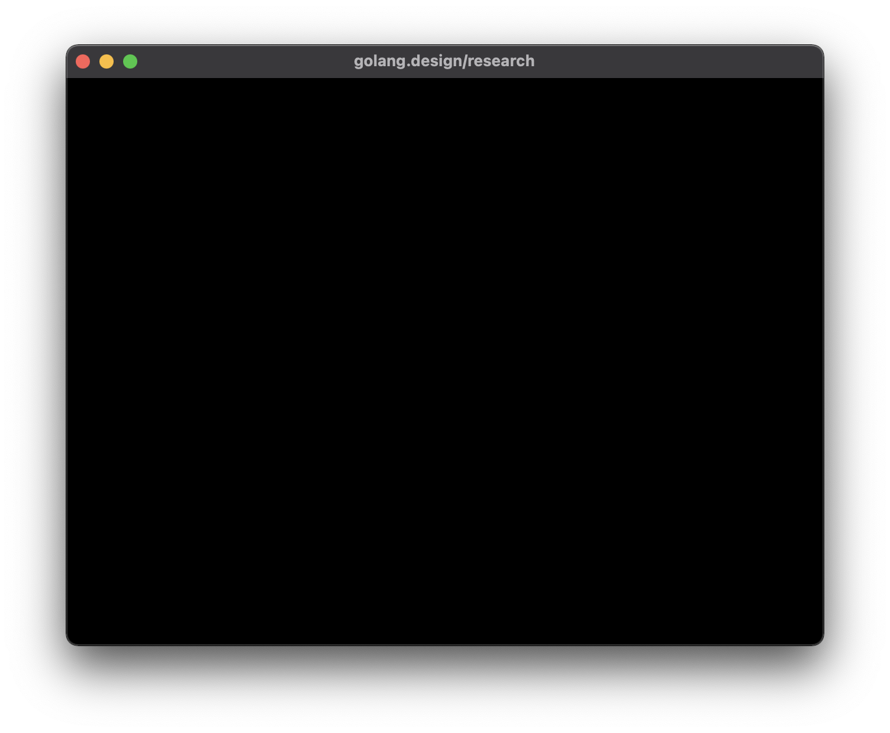
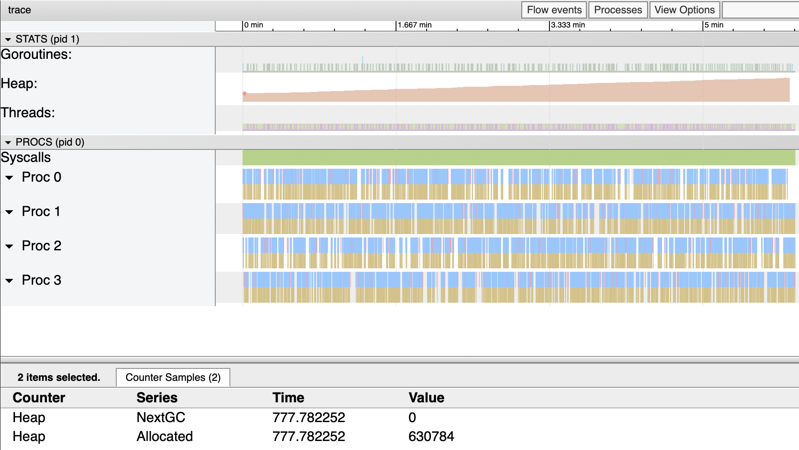
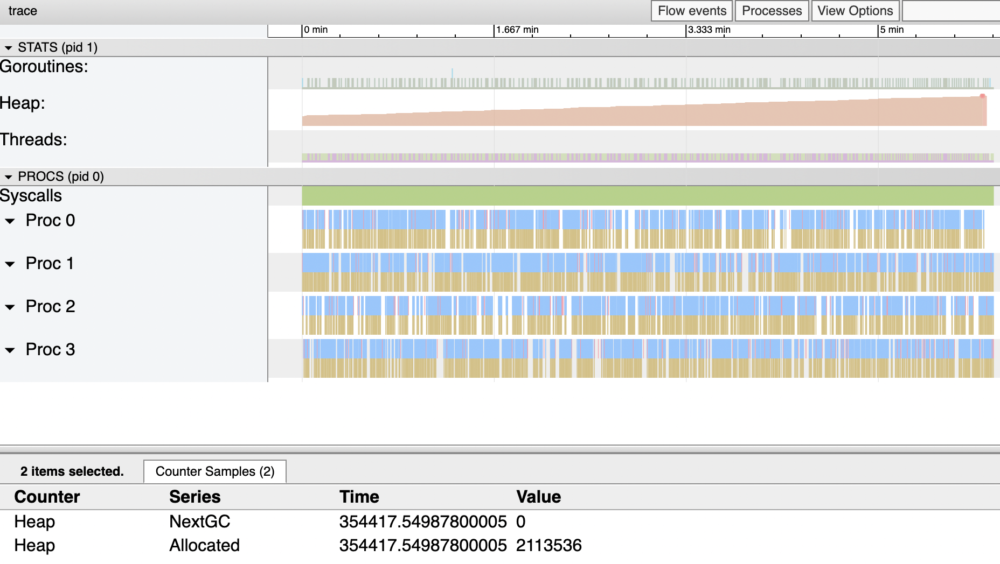
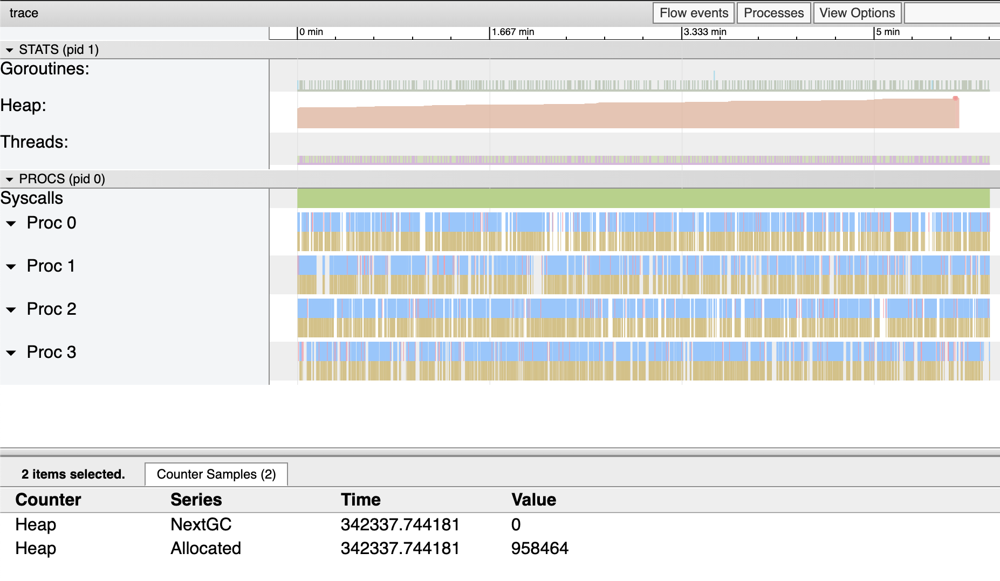

Author(s): [Changkun Ou](mailto:research[at]changkun.de)

Permalink: https://golang.design/research/zero-alloc-call-sched

<!--abstract-->
GUI programming in Go is a little bit tricky. The infamous issue
regarding interacting with legacy, GUI frameworks is that
most graphics related APIs must be called from the main thread.
The issue violates the concurrent nature of Go: A goroutine maybe
arbitrarily and randomly scheduled or rescheduled on different running
threads, i.e., the same piece of code will be called from different
threads over time, even without evolving the `go` keyword.
<!--more-->

## Background

In multithreaded programming, operating systems provide space,
the so-called Thread Local Storage (TLS) for each thread of a process
to store their private and local content. In the era where
multithreaded programming and scheduling algorithms are not rich enough,
the TLS feature was handy to avoid data race since this storage is
purely local and guaranteed by the operating system.

For example, a graphics rendering backend such as OpenGL Context
was designed to store each thread's rendering context on TLS;
In macOS, the famous GUI framework Cocoa also requires rendering
user interfaces on a specific thread,
which is the so-called *main thread*.

## The Main Thread

In Go, as we know that a goroutine will be scheduled to different
threads due to its internal work-stealing scheduler [^work-steal] [^go11sched].

With a work-stealing scheduler, goroutines are not promised to run
on a specific thread forever. Instead, whenever a goroutine goes to
sleep or entering a system call, or the Go runtime proactively
interrupts the execution of that goroutine, it is likely to
be rescheduled to a different thread. Therefore, if an (OpenGL)
rendering context is stored on the old thread, switching to a new thread
will cause the old context's loss.
**Because such an interruption can happen at any time and anywhere,
it is impossible to check if the goroutine remains on the same thread
when the execution resumes.**

The original intention of designing such a scheduler is to eliminate
the concept of system thread and multiplex it. In this way, users will
not suffer from paying the cost of threads switch/sleep, whereas threads
always in their full power mode that is continuously running tasks either
from the user or the runtime.

### Method `runtime.LockOSThread` and Package `mainthread`

If GUI applications must interact with the OS on the main thread,
how can we achieve the goal of running a specific thread permanently?
Luckily, there is a method called `LockOSThread` offered from the
`runtime` package, provides the same feature we want:

```go
// LockOSThread wires the calling goroutine to its current operating
// system thread.
// The calling goroutine will always execute in that thread,
// and no other goroutine will execute in it,
// until the calling goroutine has made as many calls to
// UnlockOSThread as to LockOSThread.
// If the calling goroutine exits without unlocking the thread,
// the thread will be terminated.
//
// All init functions are run on the startup thread. Calling
// LockOSThread from an init function will cause the main function
// to be invoked on that thread.
//
// A goroutine should call LockOSThread before calling OS services or
// non-Go library functions that depend on per-thread state.
func LockOSThread()
```

As the `LockOSThread` document says: All `init` functions run on
the startup thread. Calling `LockOSThread` from an `init` function will
cause the primary function to be invoked on that thread.

If we think about that carefully, we will immediately realize this
allows us to identify, at least, the main thread. When we would like to
wrapping thread scheduling as a package `mainthread`, we can do
something like the following::

<!-- {linenos=inline,hl_lines=[13,16],linenostart=1} -->
```go
package mainthread // import "x/mainthread"

import "runtime"

func init() {
	runtime.LockOSThread()
}

// Init initializes the functionality of running arbitrary subsequent
// functions be called on the main system thread.
//
// Init must be called in the main.main function.
func Init(main func())

// Call calls f on the main thread and blocks until f finishes.
func Call(f func())
```

As a user of such a package, one can:

<!-- {linenos=inline,hl_lines=[15],linenostart=1} -->
```go
package main

func main() {
	mainthread.Init(fn)
}

func fn() {
	// ... do what ever we want to do in main ...
}


func gn() {
	// Wherever gn is running, the call will be executed on
	// the main thread.
	mainthread.Call(func() {
		// ... do whatever we want to run on the main thread ...
	})
}
```

Once we solved API design, the next question is: How can we implement
the `Init` and `Call`?

Well, it is not that difficult. Recall that we use `Init` method to
obtain the main thread's full control, then we should never give up
such power. Thus, creating another goroutine to run what we initially
want to run and use a channel to receive the calls that we would like
to schedule on the main thread becomes our only option:

```go
// funcQ is a global channel that responsible for receiving function
// calls that needs to run on the main thread.
var funcQ = make(chan func(), runtime.GOMAXPROCS(0))

func Init(main func()) {
	done := make(chan struct{})
	go func() {
		main()

		// main function terminates, signal and terminate
		// the main thread too.
		done <- struct{}{}
	}()

	for {
		select {
		case f := <-funcQ:
				f()
		case <-done:
			return
		}
	}
}
```

Since we have the global `funcQ`, scheduling a function via that channel
becomes an easy work:

```go
// Call calls f on the main thread and blocks until f finishes.
func Call(f func()) {
	done := make(chan struct{})
	funcQ <- func() {
		f()
		done <- struct{}{}
	}
	<-done
}
```

> Note that we use empty struct as our channel signal;
> if you are not familiar with empty struct and channels,
> you might want to read two great posts from
> Dave Cheney [^empty-struct] [^curious-channels].

To use such a package, one can use `mainthread.Call` to schedule
a call to be executed on the main thread:

```go
package main

import "x/mainthread"

func main() {
	mainthread.Init(fn)
}

func fn() {
	done := make(chan struct{})
	go gn(done)
	<-done
}

func gn(done chan<- struct{}) {
	mainthread.Call(func() {
		println("call on the main thread.")
	})
	done <- struct{}{}
}
```

### Creating A Window with `glfw` using `mainthread`

Whenever we need to wrap a window package, such as initializing `glfw` [^glfw]:

```go
package app // import "x/app"

import (
	"x/mainthread"

	"github.com/go-gl/glfw/v3.3/glfw"
)

// Init initializes an app environment.
func Init() (err error) {
	mainthread.Call(func() { err = glfw.Init() })
	return
}

// Terminate terminates the entire application.
func Terminate() {
	mainthread.Call(glfw.Terminate)
}
```

Furthermore, make sure critical calls like `glfw.WaitEventsTimeout`
inside the rendering loop always be executed from the main thread:

```go
package app // import "x/app"

// Win is a window.
type Win struct {
	win *glfw.Window
}

// NewWindow constructs a new graphical window.
func NewWindow() (*Win, error) {
	var (
		w   = &Win{}
		err error
	)
	mainthread.Call(func() {
		w.win, err = glfw.CreateWindow(640, 480,
			"golang.design/research", nil, nil)
		if err != nil {
			return
		}
	})
	if err != nil {
		return nil, err
	}
	w.win.MakeContextCurrent()
	return w, nil
}

// Run runs the given window and blocks until it is destroied.
func (w *Win) Run() {
	for !w.win.ShouldClose() {
		w.win.SwapBuffers()
		mainthread.Call(func() {
			// This function must be called from the main thread.
			glfw.WaitEventsTimeout(1.0 / 30)
		})
	}
	// This function must be called from the mainthread.
	mainthread.Call(w.win.Destroy)
}
```

As a user of the `app` package, we can get rid of the understanding
overhead regarding when and how should we call a function
on the main thread::

```go
package main

import (
	"x/app"
	"x/mainthread"
)

func main() {
	mainthread.Init(fn)
}

func fn() {
	err := app.Init()
	if err != nil {
		panic(err)
	}
	defer app.Terminate()
	w, err := app.NewWindow()
	if err != nil {
		panic(err)
	}
	w.Run()
}
```



Now, we have an empty solid window and will never crash randomly 😄.

## Cost Analysis and Optimization


After implementing a first iteration of the `mainthread` package,
we might directly wonder about this package's performance.
A question could be:

_What is the latency when calling such a function if it is transmitted
from a thread to the main thread?_

Let us write a few benchmark tests that can measure the performance of
such a call. The idea is straightforward, and we need a baseline to
identify the initial cost of calling a function, then measure
the completion time when we schedule the same function call
on the main thread:

```go
var f = func() {}

// Baseline: call f() directly.
func BenchmarkDirectCall(b *testing.B) {
	b.ReportAllocs()
	b.ResetTimer()
	for i := 0; i < b.N; i++ {
		f()
	}
}

// MainthreadCall: call f() on the mainthread.
func BenchmarkMainThreadCall(b *testing.B) {
	mainthread.Init(func() {
		b.ReportAllocs()
		b.ResetTimer()
		for i := 0; i < b.N; i++ {
			mainthread.Call(f)
		}
	})
}
```

Be careful with micro-benchmarks here: Referring to our previous
discussion about the time measurement of benchmarks [^bench-time],
let us use the benchmarking tool [^bench-tool]. The `bench` is a tool
for executing Go benchmarks reliably, and it automatically locks
the machine's performance and executes benchmarks 10x by default
to eliminate system measurement error:

```
$ bench
goos: darwin
goarch: arm64
pkg: x/mainthread-naive
...

name              time/op
DirectCall-8      0.95ns ±1%
MainThreadCall-8   448ns ±0%

name              alloc/op
DirectCall-8       0.00B
MainThreadCall-8    120B ±0%

name              allocs/op
DirectCall-8        0.00
MainThreadCall-8    2.00 ±0%
```

The benchmark result indicates that calling an empty function directly
in Go will `1ns` whereas schedule the same empty function to
the main thread will spend `448ns`. Thus the cost is `447ns`.

Moreover, when we talk about cost, we care about the cost of CPU and
memory consumption. According to the second report regarding `allocs/op`,
the result shows scheduling an empty function to the `mainthread`
will cost `120B` allocation.

Allocation of `120B` per operation might not be a big deal from
our first impression. However, if we consider the actual use case of
this package, i.e., managing GUI rendering calls, either CPU or
memory allocation can be propagated to a considerable cost over time.
If we are dealing with rendering, especially graphical rendering,
the new rate is typically a minimum of 25fps, ideally 30fps or even higher.

That means, for every 5 minutes, without considering mouse button,
movements, and keystrokes, a GUI application will allocate at least:

$$
5 \times 60\times 30 \times 120 \text{byte} = 1.08 \text{MiB}
$$

A direct impact from an excessive allocation behavior is the runtime
garbage collector and the scavenger. With a higher allocation rate,
the garbage collector is triggered more often, and the scavenger
releases memory to the OS more often. Because more works are produced
for the GC, the GC will also consume more CPU from the system.
It is good enough to say the entire application is a vicious circle.

The following is trace information of that above application runs
in 6 minutes, and the total heap allocation is 1.41 MiB
(2113536-630784 byte), pretty close to what we predicted before.




Where does the allocation occur?
How can we deal with these issues?
How to optimize the existing naive implementation?
Let us find out in the next section.

## Optimal Threading Control

The first optimization comes to the attempt to avoid allocating channels.
In our `Call` implementation, we allocate a signal channel for
every function that we need to call from the main thread:

<!-- {linenos=inline,hl_lines=[3],linenostart=1} -->
```go
// Call calls f on the main thread and blocks until f finishes.
func Call(f func()) {
	done := make(chan struct{}) // allocation!
	funcQ <- func() {
		f()
		done <- struct{}{}
	}
	<-done
}
```

Thus, whenever we call the `Call` method, we will have to allocate
at least 96 bytes for a channel due to the Go compiler will uses
`runtime.hchan` as the struct that represents the channel under the hood:

```go
// in src/runtime/chan.go

// the hchan struct needs 96 bytes.
type hchan struct {
	qcount   uint
	dataqsiz uint
	buf      unsafe.Pointer
	elemsize uint16
	closed   uint32
	elemtype *_type
	sendx    uint
	recvx    uint
	recvq    waitq
	sendq    waitq
	lock     mutex
}
```

A well-known trick to avoid repetitive allocation is to use
the `sync.Pool`. One can:

<!-- {linenos=inline,hl_lines=["1-3", 6, 7],linenostart=1} -->
```go
var donePool = sync.Pool{New: func() interface{} {
	return make(chan struct{})
}}

func Call(f func()) {
	// reuse signal channel via sync.Pool!
	done := donePool.Get().(chan struct{})
	defer donePool.Put(done)

	funcQ <- func() {
		f()
		done <- struct{}{}
	}
	<-done
}
```

With that simple optimization, a benchmarked result indicates
an 80% reduction of memory usage:

<!-- {linenos=inline,hl_lines=[3,7,11],linenostart=1} -->
```txt
name              old time/op    new time/op      delta
DirectCall-8      0.95ns ±1%         0.95ns ±1%    ~     (p=0.631 n=10+10)
MainThreadCall-8   448ns ±0%         440ns ±0%   -1.83%  (p=0.000 n=9+9)

name              old alloc/op   new alloc/op     delta
DirectCall-8       0.00B            0.00B          ~     (all equal)
MainThreadCall-8    120B ±0%          24B ±0%   -80.00%  (p=0.000 n=10+10)

name              old allocs/op  new allocs/op    delta
DirectCall-8        0.00             0.00          ~     (all equal)
MainThreadCall-8    2.00 ±0%         1.00 ±0%   -50.00%  (p=0.000 n=10+10)
```

Can we do it even better? The answer is yes. One can notice that
there is still a 24B of allocation per operation. However, to identify
it becomes somewhat tricky.

In Go, variables can be allocated from heap if:

1. Using `make` and `new` keywords explicitly, or
2. Escape from the stack

The second case is a little bit advance from the regular use of Go.
To be short, escape from the execution stack to the heap is decided
from compile time. The Go's compiler will decide when a variable should
be allocated on the heap. Deciding to allocate variables either
on the stack or the heap is called _escape analysis_.

The great thing about Go is that this information is trackable and
can be enabled directly from the Go toolchain.
One can use `-gcflags="-m"` to activate the escape analysis and
see the result from the compile-time:

```shell
$ go build -gcflags="-m"
./mainthread.go:52:11: can inline Call.func1
./mainthread.go:48:11: leaking param: f
./mainthread.go:52:11: func literal escapes to heap
```

The compiler shows us that the sending function is leaking,
and the wrapper function that sends via our `funcQ` is causing
the function literal escaping to the heap.
The function literal escapes to the heap because a function literal
is considered a pointer, and sending a pointer via channel will always
cause an escape by design.

To avoid the escaping function literal, instead of using
a function wrapper, we can send a struct:

<!-- {linenos=inline,hl_lines=["1-4", 10],linenostart=1} -->
```go
type funcdata struct {
	fn   func()
	done chan struct{}
}

func Call(f func()) {
	done := donePool.Get().(chan struct{})
	defer donePool.Put(done)

	funcQ <- funcdata{fn: f, done: done} // wrap the information
	<-done
}
```

and when we receive the `funcdata`:

<!-- {linenos=inline,hl_lines=["6-8"],linenostart=1} -->
```go
func Init(main func()) {
	...

	for {
		select {
		case fdata := <-funcQ:
			fdata.fn()
			fdata.done <- struct{}{}
		case <-done:
			return
		}
	}
}
```

After such an optimization, a re-benchmarked result indicates that
we hint the zero-allocation goal:

<!-- {linenos=table,hl_lines=[3,7,11],linenostart=1} -->
```txt
name              old time/op     new time/op     delta
DirectCall-8      0.95ns ±1%      0.95ns ±1%        ~      (p=0.896 n=10+10)
MainThreadCall-8   448ns ±0%       366ns ±1%     -18.17%   (p=0.000 n=9+9)

name              old alloc/op    new alloc/op    delta
DirectCall-8       0.00B             0.00B          ~      (all equal)
MainThreadCall-8    120B ±0%            0B      -100.00%   (p=0.000 n=10+10)

name              old allocs/op   new allocs/op   delta
DirectCall-8        0.00             0.00           ~      (all equal)
MainThreadCall-8    2.00 ±0%         0.00       -100.00%   (p=0.000 n=10+10)
```

Hooray! 🎉

## Verification and Discussion

Before we conclude this research, let us do a final verification on
the real-world example that we had before: the GUI application.

While a re-evaluation, we can see from the trace file that the entire
application is still allocating memory and the heap is still increasing:



Notably, the total allocated bytes during the application life cycle (6 minutes)
only allocates:

$$ 958464 - 622592 = 0.32 \text{MiB} $$

Compared to the previous 1.41 MiB allocation, we optimized 1.08 MiB of memory,
which we precisely predicted before.

We might still wonder if scheduling is not allocating memory anymore,
who is still allocating the memory? To find out, we need a little bit of
help from the `runtime` package. The compiler translates the allocation
operation to a runtime function `runtime.newobject`. One can add 3
more lines and prints, which is exactly calling this function
using `runtime.FuncForPC`:

<!-- {linenos=inline,hl_lines=["3-5"],linenostart=1} -->
```go
// src/runtime/malloc.go
func newobject(typ *_type) unsafe.Pointer {
	f := FuncForPC(getcallerpc())       // add this
	l, ll := f.FileLine(getcallerpc())  // add this
	println(typ.size, f.Name(), l, ll)  // add this
	return mallocgc(typ.size, typ, true)
}
```

In the above, the `getcallerpc` is a runtime private helper.
If we execute the application again, we will see printed information
similar to below:

```
88 runtime.acquireSudog /Users/changkun/dev/godev/go-github/src/runtime/proc.go 375
88 runtime.acquireSudog /Users/changkun/dev/godev/go-github/src/runtime/proc.go 375
88 runtime.acquireSudog /Users/changkun/dev/godev/go-github/src/runtime/proc.go 375
...
```

It demonstrates how and why the allocation still happens:

<!-- {linenos=inline,hl_lines=[23],linenostart=1} -->
```go
// ch <- elem
func chansend(c *hchan, ep unsafe.Pointer, block bool, callerpc uintptr) bool {
	...
	gp := getg()
	mysg := acquireSudog()
	...
}

//go:nosplit
func acquireSudog() *sudog {
	mp := acquirem()
	pp := mp.p.ptr()
	if len(pp.sudogcache) == 0 {
		lock(&sched.sudoglock)
		for len(pp.sudogcache) < cap(pp.sudogcache)/2 && sched.sudogcache != nil {
			s := sched.sudogcache
			sched.sudogcache = s.next
			s.next = nil
			pp.sudogcache = append(pp.sudogcache, s)
		}
		unlock(&sched.sudoglock)
		if len(pp.sudogcache) == 0 {
			pp.sudogcache = append(pp.sudogcache, new(sudog)) // !here
		}
	}
	...
}
```

Unfortunately, this is entirely outside the control of the userland.
We are not able to optimize here anymore.
Nevertheless, we have reached our goal for today, and this is the best
of what we can do so far.

One more thing, if we take a closer look into how much the heap grows
for one step, we will get some calculation like this: 671744-663552=8192
The result is, in fact, the minimum allocation size of the runtime allocator,
which allocates a _page_. Since the discussion of such a topic
has deviated from this research's goal, we leave that as a future outlook.

## Conclusion

In this research, we covered the following topics:

1. The Go runtime scheduler
2. The Go runtime memory allocator
3. The Go runtime garbage collector
4. Scheduling on a specific thread, especially the main thread
5. Reliable benchmarking and allocations tracing techniques
6. Escape analysis
7. The channel implementation in Go

There are several points we can summarize:

1. A channel allocates 96 bytes of memory
2. A function literal allocate 24 bytes of memory
3. Escape analysis can help us identify unexpected allocations, and function literal is considered as a pointer that always escapes to the heap
4. Sending information via a channel can cause allocation intrinsically from the runtime.
5. Go runtime grows the heap 8K on each step as page allocation

We also encapsulated all the abstractions from this research and published two packages: `mainthread`[^mainthread] and `thread`[^thread]. These packages allow us to schedule any function calls either on the main thread or a specific thread. Furthermore, We also submitted a pull request to the Fyne project[^fyne], which could reduce a considerable amount of memory allocations from the existing real-world GUI applications.

Have fun!

## References

[^work-steal]: Robert D. Blumofe and Charles E. Leiserson. 1999. "Scheduling multithreaded computations by work stealing." J. ACM 46, 5 (September 1999), 720-748. https://dl.acm.org/citation.cfm?id=324234
[^go11sched]: Dmitry Vyukov. "Scalable Go Scheduler Design Doc." May 2, 2012. https://golang.org/s/go11sched
[^glfw]: The glfw Library. https://www.glfw.org/
[^bench-time]: Changkun Ou. "Eliminating A Source of Measurement Errors in Benchmarks
." 30.09.2020. https://golang.design/research/bench-time/
[^bench-tool]: Changkun Ou. "bench: Reliable performance measurement for Go programs. All in one design." https://golang.design/s/bench
[^empty-struct]: Dave Cheney. "The empty struct." March 25, 2014. https://dave.cheney.net/2014/03/25/the-empty-struct
[^curious-channels]: Dave Cheney. "Curious Channels." April 30, 2013. https://dave.cheney.net/2013/04/30/curious-channels
[^mem-alloc]: Dave Cheney. "A few bytes here, a few there, pretty soon you're talking real memory." Jan 05, 2021. https://dave.cheney.net/2021/01/05/a-few-bytes-here-a-few-there-pretty-soon-youre-talking-real-memory
[^mainthread]: Changkun Ou. "Package golang.design/x/mainthread." https://golang.design/s/mainthread
[^thread]: Changkun Ou. "Package golang.design/x/thread." https://golang.design/s/thread
[^fyne]: Changkun Ou. "Optimize the cost of calling on the main/draw threads." Jan 20, 2021 https://github.com/fyne-io/fyne/pull/1837